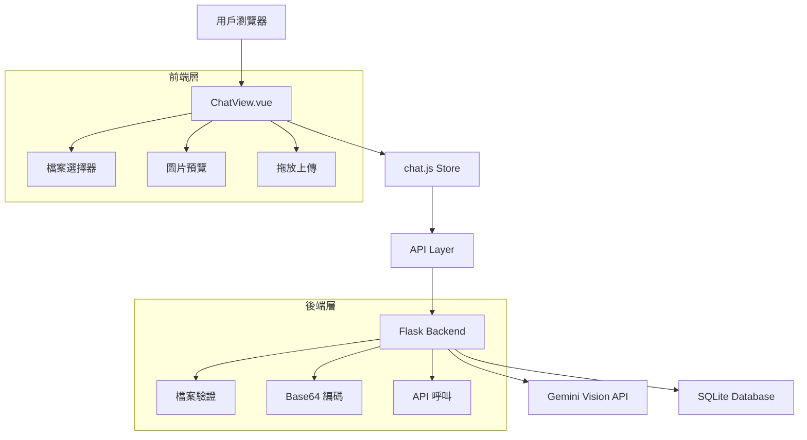
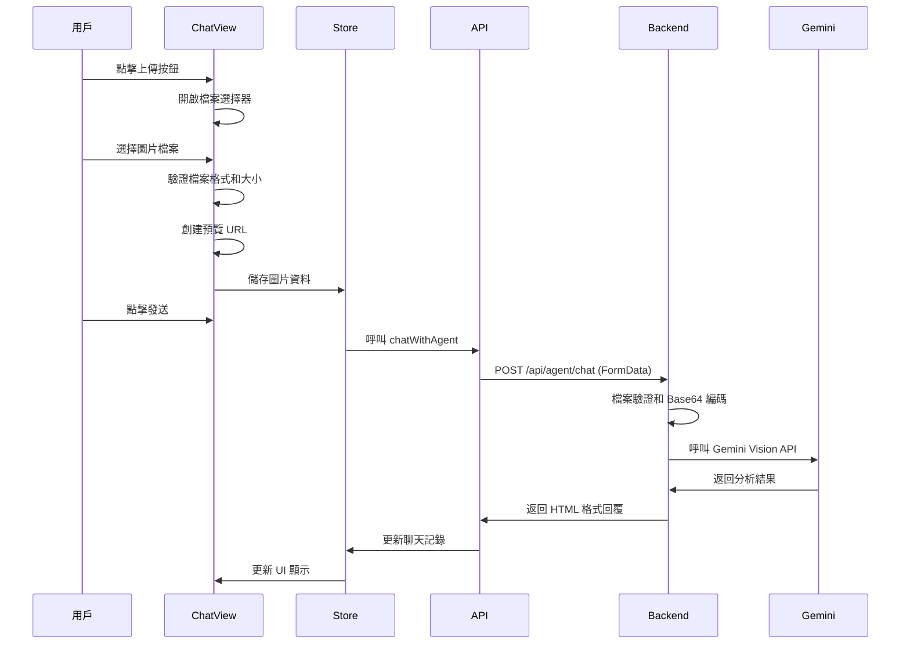
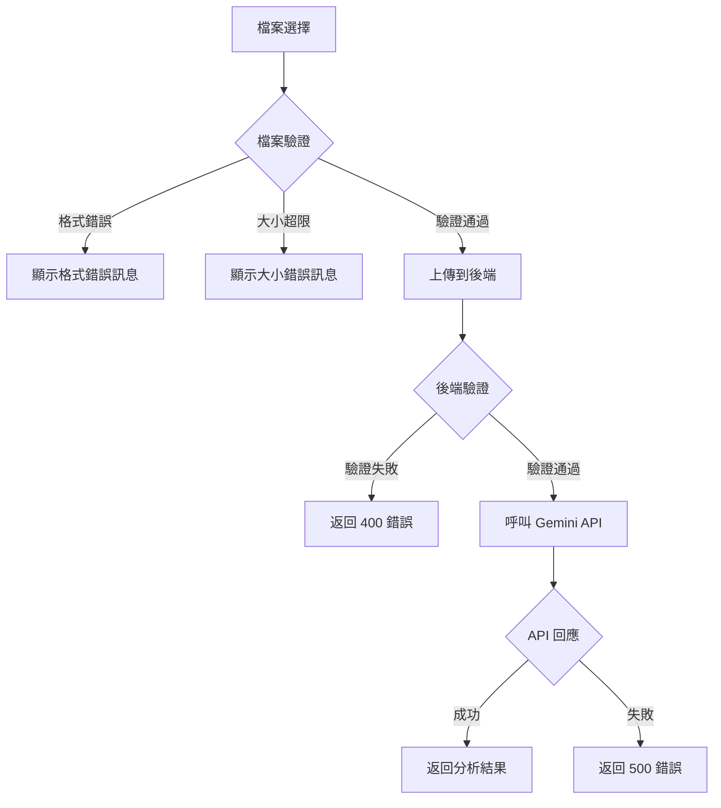

# 🔧 照片上傳功能 - 技術實作文檔

## 📊 系統架構概覽



## 🗂️ 程式碼檔案詳細說明

### 前端檔案 (Frontend)

#### 1. `/frontend/src/views/ChatView.vue`
**功能**：主要的聊天界面組件，包含照片上傳功能

**關鍵代碼區段**：
```vue
<!-- 照片上傳按鈕 -->
<el-button
  type="info"
  :icon="Picture"
  @click="openFileSelector"
  :disabled="chatStore.isLoading"
  title="上傳山羊照片"
>
  上傳照片
</el-button>

<!-- 隱藏的檔案輸入元素 -->
<input
  ref="fileInputRef"
  type="file"
  accept="image/*"
  @change="handleImageSelect"
  style="display: none;"
/>
```

**主要方法**：
- `openFileSelector()`: 開啟檔案選擇器
- `handleImageSelect(event)`: 處理檔案選擇事件
- `removeSelectedImage()`: 移除選中的圖片
- `handleSendMessage()`: 發送訊息（包含圖片）

**資料結構**：
```javascript
const selectedImage = ref({
  file: File,           // 原始檔案對象
  url: String,          // Data URL 用於預覽
  name: String,         // 檔案名稱
  size: Number,         // 檔案大小
  type: String          // MIME 類型
});
```

#### 2. `/frontend/src/stores/chat.js`
**功能**：聊天狀態管理，處理訊息和圖片資料

**關鍵方法**：
```javascript
async function sendMessage(apiKey, userMessage, earNumContext, imageData = null) {
  // 準備用戶訊息物件
  const userMessageObj = { 
    role: 'user', 
    content: userMessage || (imageData ? '請幫我分析這張山羊照片' : '')
  };
  
  // 如果有圖片，添加圖片資訊
  if (imageData) {
    userMessageObj.image = {
      url: imageData.url,
      name: imageData.name,
      type: imageData.type
    };
  }
  
  // 呼叫 API
  const response = await api.chatWithAgent(
    apiKey, userMessage, sessionId.value, earNumContext, imageData
  );
}
```

#### 3. `/frontend/src/api/index.js`
**功能**：API 呼叫層，處理 HTTP 請求

**關鍵方法**：
```javascript
chatWithAgent(apiKey, message, sessionId, earNumContext, imageData = null, errorHandler) {
  // 如果有圖片，使用 FormData
  if (imageData && imageData.file) {
    const formData = new FormData();
    formData.append('api_key', apiKey);
    formData.append('message', message);
    formData.append('session_id', sessionId);
    if (earNumContext) formData.append('ear_num_context', earNumContext);
    formData.append('image', imageData.file);
    
    return withErrorHandling(() => 
      apiClient.post('/api/agent/chat', formData, {
        headers: { 'Content-Type': 'multipart/form-data' }
      }), errorHandler);
  } else {
    // 純文字請求
    const payload = { api_key: apiKey, message, session_id: sessionId, ear_num_context: earNumContext };
    return withErrorHandling(() => apiClient.post('/api/agent/chat', payload), errorHandler);
  }
}
```

### 後端檔案 (Backend)

#### 1. `/backend/app/api/agent.py`
**功能**：主要的 API 端點，處理聊天和圖片分析

**關鍵路由**：
```python
@bp.route('/chat', methods=['POST'])
@login_required
def chat_with_agent():
    """與 AI 聊天，支援文字和圖片"""
```

**圖片處理流程**：
```python
# 1. 檢查請求類型
if 'image' in request.files:
    # 處理包含圖片的請求
    image_file = request.files['image']
    
    # 2. 檔案驗證
    allowed_types = ['image/jpeg', 'image/jpg', 'image/png', 'image/gif', 'image/webp']
    if image_file.content_type not in allowed_types:
        return jsonify(error="不支援的圖片格式"), 400
    
    # 3. 大小檢查
    image_data = image_file.read()
    if len(image_data) > 10 * 1024 * 1024:  # 10MB
        return jsonify(error="圖片檔案不能超過 10MB"), 400
    
    # 4. Base64 編碼
    image_base64 = base64.b64encode(image_data).decode('utf-8')
```

**Gemini API 整合**：
```python
# 準備包含圖片的訊息
user_message_parts = [{"text": current_user_message_with_context}]
if image_base64:
    user_message_parts.append({
        "inline_data": {
            "mime_type": mime_type,
            "data": image_base64
        }
    })

chat_messages_for_api.append({"role": "user", "parts": user_message_parts})
```

#### 2. `/backend/app/utils.py`
**功能**：工具函數，包含 Gemini API 呼叫

**關鍵函數**：
```python
def call_gemini_api(prompt_text, api_key, generation_config_override=None, safety_settings_override=None):
    """
    通用 Gemini API 調用函數，支援文字和圖片
    """
    # 處理多種輸入格式
    payload_contents = []
    if isinstance(prompt_text, str):
        payload_contents.append({"role": "user", "parts": [{"text": prompt_text}]})
    elif isinstance(prompt_text, list):
        payload_contents = prompt_text  # 已經格式化的訊息陣列

def encode_image_to_base64(image_data):
    """
    將圖片數據編碼為 base64 字符串
    """
    return base64.b64encode(image_data).decode('utf-8')
```

#### 3. `/backend/app/models.py`
**功能**：資料庫模型定義

**聊天記錄模型**：
```python
class ChatHistory(db.Model):
    id = db.Column(db.Integer, primary_key=True)
    user_id = db.Column(db.Integer, db.ForeignKey('user.id'), nullable=False)
    session_id = db.Column(db.String(100), nullable=False)
    role = db.Column(db.String(20), nullable=False)  # 'user' 或 'model'
    content = db.Column(db.Text, nullable=False)     # 包含 "[包含圖片]" 標記
    ear_num_context = db.Column(db.String(50))
    timestamp = db.Column(db.DateTime, default=datetime.utcnow)
```

#### 4. `/backend/app/schemas.py`
**功能**：請求資料驗證

**聊天請求模型**：
```python
class AgentChatModel(BaseModel):
    api_key: str
    message: str
    session_id: str
    ear_num_context: Optional[str] = None
    
    class Config:
        str_strip_whitespace = True
```

## 🔄 資料流程

### 1. 圖片上傳流程


### 2. 錯誤處理流程


## 🛠️ 開發環境設定

### 前端設定
```bash
cd frontend
npm install
npm run dev
```

**關鍵依賴**：
- `vue@^3.4.0`
- `element-plus@^2.4.0`
- `@element-plus/icons-vue@^2.3.0`
- `pinia@^2.1.0`
- `axios@^1.6.0`

### 後端設定
```bash
cd backend
pip install -r requirements.txt
export GOOGLE_API_KEY=your_gemini_api_key
python run.py
```

**關鍵依賴**：
- `Flask==2.3.3`
- `Flask-Login==0.6.3`
- `SQLAlchemy==2.0.21`
- `Pydantic==2.4.2`
- `requests==2.31.0`

## 🧪 測試策略

### 單元測試
```javascript
// frontend/src/stores/chat.test.js
describe('Chat Store - Image Upload', () => {
  test('should handle image data correctly', () => {
    const imageData = {
      file: new File(['test'], 'test.jpg', { type: 'image/jpeg' }),
      url: 'data:image/jpeg;base64,...',
      name: 'test.jpg',
      size: 1024,
      type: 'image/jpeg'
    };
    
    // 測試 sendMessage 方法
    expect(sendMessage('api_key', 'test message', null, imageData)).toBeDefined();
  });
});
```

### 整合測試
```python
# test_image_upload.py
def test_image_upload_api():
    """測試圖片上傳 API 端點"""
    with open('test_image.jpg', 'rb') as f:
        response = client.post('/api/agent/chat', data={
            'api_key': 'test_key',
            'message': 'Analyze this image',
            'session_id': 'test_session',
            'image': (f, 'test.jpg')
        })
    assert response.status_code == 200
```

## 🔍 偵錯指南

### 前端偵錯
```javascript
// 在 ChatView.vue 中添加日誌
const handleImageSelect = (event) => {
  console.log('Selected file:', event.target.files[0]);
  // ... 處理邏輯
};
```

### 後端偵錯
```python
# 在 agent.py 中添加日誌
current_app.logger.info(f"Received image: {image_file.filename}, size: {len(image_data)}")
```

### 常見問題排查

1. **CORS 錯誤**
   - 檢查 Flask CORS 設定
   - 確認請求標頭正確

2. **檔案上傳失敗**
   - 檢查 Content-Type 是否為 multipart/form-data
   - 確認檔案大小限制

3. **API 金鑰錯誤**
   - 驗證 Gemini API 金鑰有效性
   - 檢查環境變數設定

## 📈 效能最佳化

### 前端優化
```javascript
// 圖片壓縮
const compressImage = (file, maxSize = 1024 * 1024) => {
  return new Promise((resolve) => {
    const canvas = document.createElement('canvas');
    const ctx = canvas.getContext('2d');
    const img = new Image();
    
    img.onload = () => {
      // 計算壓縮比例
      const ratio = Math.min(800 / img.width, 800 / img.height);
      canvas.width = img.width * ratio;
      canvas.height = img.height * ratio;
      
      ctx.drawImage(img, 0, 0, canvas.width, canvas.height);
      canvas.toBlob(resolve, 'image/jpeg', 0.8);
    };
    
    img.src = URL.createObjectURL(file);
  });
};
```

### 後端優化
```python
# 非同步處理
import asyncio
from concurrent.futures import ThreadPoolExecutor

async def process_image_async(image_data, api_key):
    loop = asyncio.get_event_loop()
    with ThreadPoolExecutor() as executor:
        result = await loop.run_in_executor(
            executor, call_gemini_api, image_data, api_key
        )
    return result
```

## 🚀 部署注意事項

### 環境變數
```bash
# .env 檔案
GOOGLE_API_KEY=your_gemini_api_key_here
MAX_CONTENT_LENGTH=10485760  # 10MB
UPLOAD_FOLDER=/tmp/uploads
```

### Docker 配置
```dockerfile
# 後端 Dockerfile 片段
RUN mkdir -p /tmp/uploads && \
    chmod 755 /tmp/uploads

ENV MAX_CONTENT_LENGTH=10485760
```

### Nginx 設定
```nginx
# 增加檔案上傳大小限制
client_max_body_size 10M;

# 代理設定
location /api/agent/chat {
    proxy_pass http://backend:5000;
    proxy_set_header Content-Type $content_type;
}
```

---

*技術文檔版本：v1.0.0*  
*最後更新：2025年8月1日*
