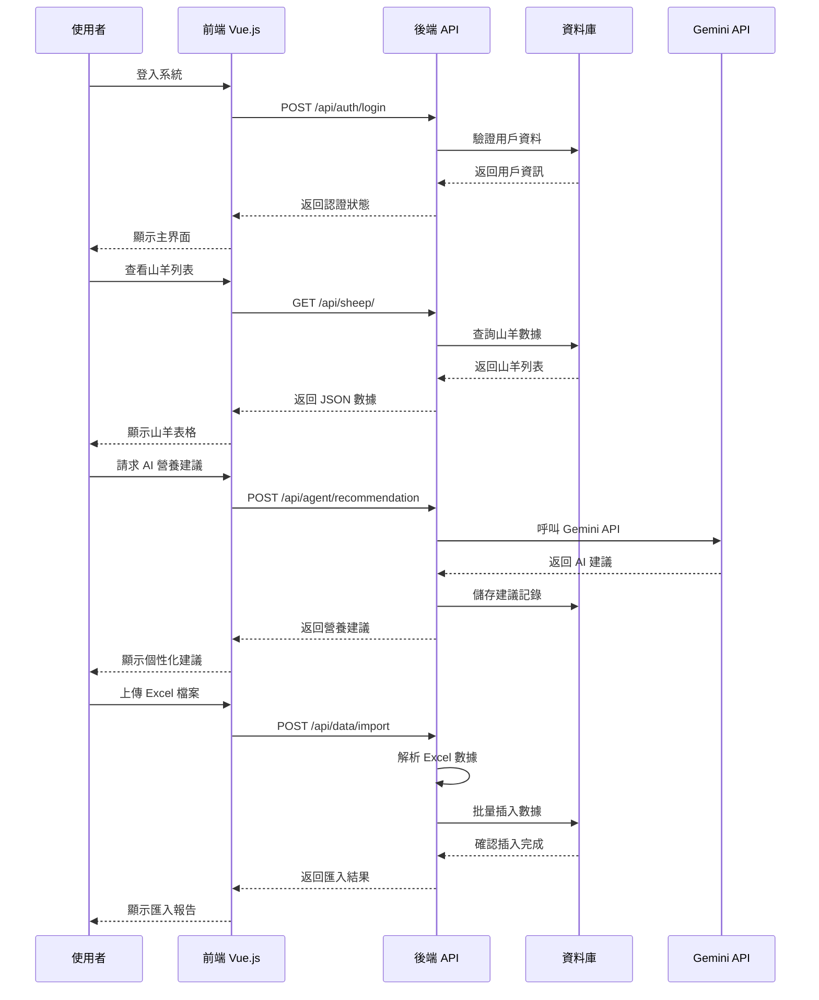
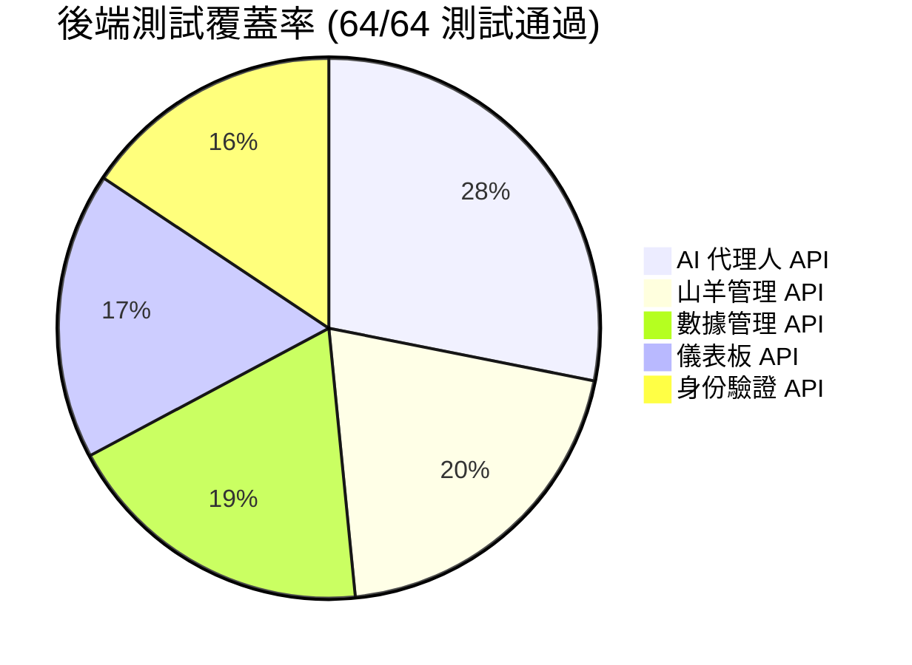
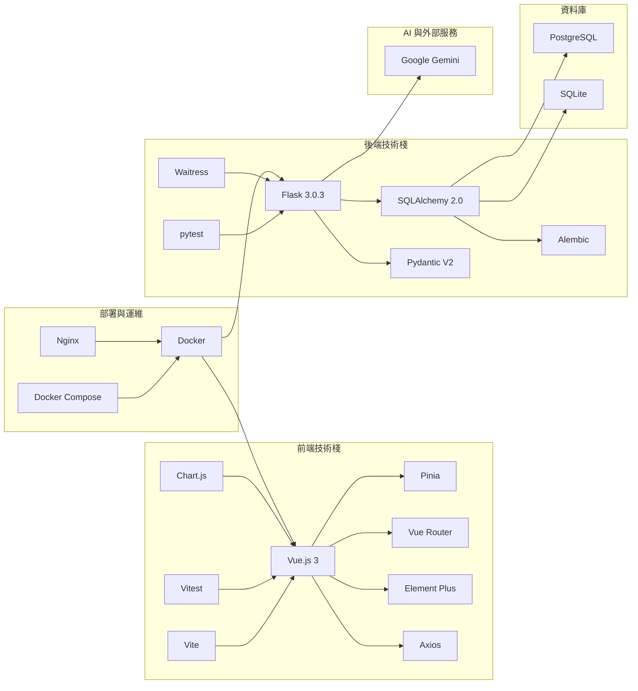

# 領頭羊博士 - 系統架構流程圖

## 完整系統架構 (Mermaid 圖表)

```mermaid
graph TB
    subgraph "使用者端"
        User[👤 使用者]
        Browser[🌐 瀏覽器]
    end

    subgraph "前端應用 - Vue.js 3"
        App[App.vue<br/>主應用程式]
        Router[Vue Router<br/>路由管理]
        Store[Pinia Store<br/>狀態管理]
        
        subgraph "頁面組件"
            Login[LoginView<br/>登入頁面]
            Dashboard[DashboardView<br/>儀表板]
            SheepList[SheepListView<br/>山羊列表]
            Chat[ChatView<br/>AI 聊天]
            DataMgmt[DataManagementView<br/>數據管理]
        end
        
        subgraph "可重用組件"
            SheepTable[SheepTable<br/>山羊表格]
            SheepModal[SheepModal<br/>山羊模態框]
            SheepFilter[SheepFilter<br/>山羊篩選器]
        end
        
        API_Client[Axios<br/>API 客戶端]
    end

    subgraph "後端應用 - Flask 3.0.3"
        Flask_App[Flask 應用程式<br/>(__init__.py)]
        
        subgraph "API 藍圖"
            Auth_API[auth.py<br/>身份驗證 API<br/>✅ 10 tests]
            Sheep_API[sheep.py<br/>山羊管理 API<br/>✅ 13 tests]
            Agent_API[agent.py<br/>AI 代理人 API<br/>✅ 18 tests] 
            Dashboard_API[dashboard.py<br/>儀表板 API<br/>✅ 11 tests]
            Data_API[data_management.py<br/>數據管理 API<br/>✅ 12 tests]
        end
        
        Models[models.py<br/>SQLAlchemy 模型]
        Schemas[schemas.py<br/>Pydantic 驗證]
        Utils[utils.py<br/>工具函數]
    end

    subgraph "外部服務"
        Gemini[Google Gemini API<br/>🤖 AI 服務]
    end

    subgraph "資料庫"
        PostgreSQL[(PostgreSQL<br/>生產資料庫)]
        SQLite[(SQLite<br/>開發資料庫)]
    end

    subgraph "測試架構"
        subgraph "後端測試 ✅"
            TestAuth[test_auth_api.py<br/>10 tests]
            TestSheep[test_sheep_api.py<br/>13 tests]
            TestAgent[test_agent_api.py<br/>18 tests]
            TestDash[test_dashboard_api.py<br/>11 tests]
            TestData[test_data_management_api.py<br/>12 tests]
        end
        
        subgraph "前端測試 🔄"
            TestVitest[Vitest 測試框架]
            TestSheepComp[SheepFilter.test.js]
            TestStore[sheep.test.js]
        end
    end

    subgraph "部署架構"
        Docker[Docker Compose]
        Nginx[Nginx<br/>反向代理]
        Waitress[Waitress<br/>WSGI 伺服器]
    end

    %% 連接關係
    User --> Browser
    Browser --> App
    App --> Router
    Router --> Login
    Router --> Dashboard
    Router --> SheepList
    Router --> Chat
    Router --> DataMgmt
    
    SheepList --> SheepTable
    SheepList --> SheepModal
    SheepList --> SheepFilter
    
    Dashboard --> Store
    SheepList --> Store
    Chat --> Store
    
    Store --> API_Client
    API_Client --> Flask_App
    
    Flask_App --> Auth_API
    Flask_App --> Sheep_API
    Flask_App --> Agent_API
    Flask_App --> Dashboard_API
    Flask_App --> Data_API
    
    Auth_API --> Models
    Sheep_API --> Models
    Agent_API --> Models
    Dashboard_API --> Models
    Data_API --> Models
    
    Models --> Schemas
    Agent_API --> Utils
    Utils --> Gemini
    
    Models --> PostgreSQL
    Models --> SQLite
    
    %% 測試連接
    TestAuth -.-> Auth_API
    TestSheep -.-> Sheep_API
    TestAgent -.-> Agent_API
    TestDash -.-> Dashboard_API
    TestData -.-> Data_API
    
    TestVitest -.-> SheepFilter
    TestStore -.-> Store
    
    %% 部署連接
    Docker --> Nginx
    Docker --> Waitress
    Docker --> PostgreSQL
    Nginx --> Browser
    Waitress --> Flask_App
    
    %% 樣式
    classDef frontend fill:#42b883,stroke:#369870,stroke-width:2px,color:#fff
    classDef backend fill:#ff6b6b,stroke:#ee5a52,stroke-width:2px,color:#fff
    classDef database fill:#4ecdc4,stroke:#45b7b8,stroke-width:2px,color:#fff
    classDef test fill:#feca57,stroke:#ff9ff3,stroke-width:2px,color:#000
    classDef external fill:#a55eea,stroke:#8b5cf6,stroke-width:2px,color:#fff
    classDef deploy fill:#26de81,stroke:#20bf6b,stroke-width:2px,color:#fff
    
    class App,Router,Store,Login,Dashboard,SheepList,Chat,DataMgmt,SheepTable,SheepModal,SheepFilter,API_Client frontend
    class Flask_App,Auth_API,Sheep_API,Agent_API,Dashboard_API,Data_API,Models,Schemas,Utils backend
    class PostgreSQL,SQLite database
    class TestAuth,TestSheep,TestAgent,TestDash,TestData,TestVitest,TestSheepComp,TestStore test
    class Gemini external
    class Docker,Nginx,Waitress deploy
```

## 數據流程圖



## 測試覆蓋率視覺化



## 技術棧架構



---
**圖表說明**：
- ✅ 表示已完成且測試通過的功能
- 🔄 表示正在開發中的功能
- 👤 表示用戶相關功能
- 🤖 表示 AI 相關功能
- 📊 表示數據相關功能
